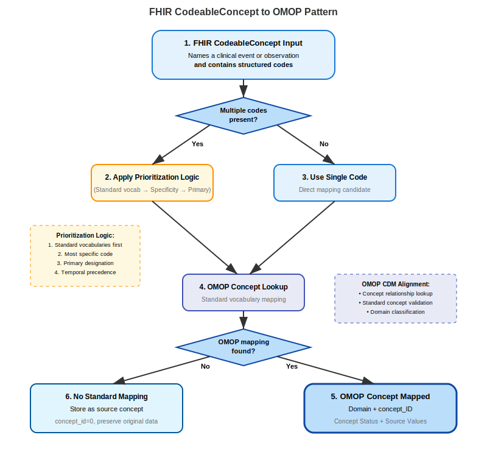

# FHIR to OMOP Code Mapping Patterns
Mapping coded data from FHIR to OMOP requires evaluation of the concepts to be stored in tables on OMOP, and these transformations can follow distinct patterns.  In this Implementation Guide, we propose transformation patterns and guidance regarding: 

* A base pattern that covers most simple code to concept transformation
* A pattern applicable to multiple CodeableConcepts scenarios
* Value-as-concept map pattern

## 1: Base Mapping Pattern

{::options parse_block_html="false" /}
<figure>
<figcaption><b>FHIR to OMOP Coded Data Base Mapping Pattern</b></figcaption>

</figure>
{::options parse_block_html="true" /}

The foundational pattern for simple code-to-concept transformations provides the essential framework that underlies all other transformation approaches. This pattern addresses the most straightforward scenarios where FHIR resources contain single, well-defined codes that can be directly mapped to OMOP standard concepts without requiring complex prioritization or decomposition logic.

The base mapping process begins with extracting coded data from FHIR resources, focusing on identifying coded elements of the type CodeableConcept or Coding within the resource structure. This extraction phase requires careful attention to the location and structure of coded elements, as they may appear in different fields depending on the FHIR resource type and profile being processed. The extraction process must capture not only the code values themselves but also the associated system identifiers and any relevant metadata that may influence the mapping process.

Following code extraction, the transformation applies the Universal Code Prioritization Framework when multiple codes exist within the source data. Even in base mapping scenarios, multiple codes may be present due to system interoperability requirements or legacy data migration processes. The prioritization framework ensures consistent selection logic that favors standard vocabularies, clinical specificity, and explicit primary designations while providing fallback mechanisms for edge cases.

The vocabulary lookup phase applies the Standard OMOP Vocabulary Lookup Methodology to identify corresponding OMOP concepts for the selected source codes. This critical step validates that source codes have appropriate representations within the OHDSI Standardized Vocabularies and determines whether direct mapping is possible or if concept relationship traversal is required for non-standard source codes.

Domain determination utilizes the Domain Assignment Logic to identify the appropriate OMOP domain table for storing the clinical information. This step recognizes that vocabulary-driven domain assignment may differ from assumptions based solely on FHIR resource types, ensuring that clinical concepts are stored in semantically appropriate locations within the OMOP analytical framework.

Non-standard concept handling addresses scenarios where source codes map to non-standard OMOP concepts, requiring traversal of the concept_relationship table to identify appropriate standard concepts for analytical use. This process maintains the connection between source codes and their standard representations while preserving the original mapping context for audit and validation purposes.

The final population phase applies the Standard OMOP Field Population Template to ensure consistent data storage across all transformation instances. This standardization supports reliable analytical processes while maintaining essential data lineage information for quality assurance and future enhancement efforts.

### Example: Diabetes Condition Mapping

Consider a straightforward diabetes diagnosis represented in a FHIR Condition resource with a single SNOMED CT code. The source resource demonstrates the ideal scenario for base pattern transformation, containing clear coded information without ambiguity or complex relationships.

```json
{
  "resourceType": "Condition",
  "id": "example",
  "code": {
    "coding": [
      {
        "system": "http://snomed.info/sct",
        "code": "44054006",
        "display": "Diabetes mellitus type 2"
      }
    ]
  },
  "subject": {
    "reference": "Patient/example"
  },
  "onsetDateTime": "2011-05-24"
}
```

The transformation process identifies SNOMED CT code 44054006 within the CodeableConcept structure, recognizing it as a single, well-defined concept suitable for direct mapping. Vocabulary lookup confirms that this code maps to OMOP concept_id 201826 with standard concept status, eliminating the need for concept relationship traversal. Domain assignment validation confirms that the concept resides in the Condition domain, aligning with the FHIR resource type and supporting storage in the condition_occurrence table.

```sql
INSERT INTO condition_occurrence (
    condition_occurrence_id,
    person_id,
    condition_concept_id,
    condition_start_date,
    condition_source_value,
    condition_source_concept_id,
    condition_type_concept_id
) VALUES (
    [generated_id],
    [mapped_person_id],
    201826,                -- Standard OMOP concept
    '2011-05-24',
    '44054006',           -- Source preservation
    201826,               -- Source concept (already standard)
    32020                 -- EHR record type
);
```

This example demonstrates the straightforward application of the base pattern, showcasing direct vocabulary mapping, domain alignment, and comprehensive source preservation. The transformation maintains clinical accuracy while conforming to OMOP analytical requirements, providing a foundation for understanding more complex transformation scenarios.

### Field Mapping Details

| OMOP Field | Value | Source | Transformation Notes |
|------------|--------|---------|---------------------|
| `condition_concept_id` | 201826 | OMOP vocabulary lookup | Standard concept from Step 2 |
| `condition_source_value` | 44054006 | FHIR code.coding[0].code | Original source code preserved |
| `condition_source_concept_id` | 201826 | Same as standard concept | Source code already standard |
| `condition_start_date` | 2011-05-24 | FHIR onsetDateTime | Date extracted from FHIR |
| `person_id` | [mapped_person_id] | FHIR subject reference | Patient reference resolution |


The example above represents a straightforward transformation scenario with a direct vocabulary match and domain alignment. Real-world implementations should prepare for more complex scenarios involving non-standard vocabularies, domain mismatches, and mapping gaps, but this base pattern provides the foundational framework for handling all transformation cases systematically and consistently.

## Pattern 2: CodeableConcept Patterns
The CodeableConcept patterns addresses the challenge of transforming FHIR CodeableConcept elements that may contain multiple codes, free text, or combinations of both. This pattern recognizes the tension between FHIR's flexibility in representing clinical concepts and OMOP's requirement for standardized, unambiguous concept identification. The approach provides systematic methodology for handling the complexity inherent in CodeableConcept structures while preserving clinical meaning and maintaining data quality standards.

CodeableConcept elements in FHIR can contain multiple coding entries, each potentially representing the same clinical concept through different terminology systems or at different levels of granularity. This multiplicity creates opportunities for enhanced semantic representation but also introduces complexity in determining which code should serve as the primary mapping target for OMOP transformation. The pattern addresses this complexity through sophisticated assessment and prioritization logic that ensures consistent, reproducible transformation outcomes.

{::options parse_block_html="false" /}
<figure>
<figcaption><b>FHIR CodeableConcept to OMOP Pattern</b></figcaption>

</figure>
{::options parse_block_html="true" /}

The transformation process begins with assessing code multiplicity within the CodeableConcept structure, determining whether multiple structured codes exist and evaluating their relationships to each other. When multiple codes are present, the system applies the Universal Code Prioritization Framework to select the most appropriate code for OMOP mapping, considering vocabulary precedence, clinical specificity, primary designations, and temporal factors.

For CodeableConcepts containing only single structured codes, the process bypasses complex prioritization logic and proceeds directly to vocabulary lookup and domain assignment. This streamlined approach recognizes that single codes represent the ideal scenario for FHIR-to-OMOP transformation, eliminating ambiguity while maintaining data integrity and processing efficiency.

The vocabulary lookup phase applies standard methodology to identify corresponding OMOP concepts, with particular attention to domain assignment that may differ from FHIR resource type expectations. This vocabulary-driven approach ensures that clinical concepts are stored in semantically appropriate OMOP domains, even when this conflicts with structural assumptions based on FHIR resource categorization.

Context preservation becomes particularly important in CodeableConcept transformation, as free text elements may contain valuable clinical information that supplements or clarifies the coded representations. The pattern provides mechanisms for preserving this contextual information in appropriate OMOP fields, ensuring that clinical nuance is not lost during the transformation process.

### Example: Mapping No Known Allergy CodeableConcept

The transformation of negative assertion concepts demonstrates the importance of vocabulary-driven domain assignment in CodeableConcept processing. Consider an AllergyIntolerance resource that documents the absence of known allergies, representing a clinical concept that challenges traditional resource-to-domain mapping assumptions.

```json
{
  "resourceType": "AllergyIntolerance",
  "id": "no-known-allergy-example",
  "code": {
    "coding": [
      {
        "system": "http://snomed.info/sct",
        "code": "716186003",
        "display": "No known allergy (situation)"
      }
    ],
    "text": "NKA"
  },
  "patient": {
    "reference": "Patient/example"
  },
  "recordedDate": "2023-01-15"
}
```
The CodeableConcept contains a single SNOMED CT code representing a standardized approach to expressing the absence of known allergies, supplemented by free text that provides additional clinical context. Vocabulary lookup reveals that SNOMED CT code 716186003 maps to OMOP concept_id 4222295, but critically, this concept resides in the Observation domain rather than the Condition domain that might be expected based on the AllergyIntolerance resource type.

This domain assignment reflects OMOP's semantic organization, where negative assertions about clinical conditions are typically modeled as observations rather than conditions themselves. The vocabulary-driven domain assignment takes precedence over resource type expectations, demonstrating the importance of semantic accuracy in OMOP transformation processes.

```sql
INSERT INTO observation (
    observation_id,
    person_id,
    observation_concept_id,
    observation_date,
    observation_source_value,
    qualifier_source_value
) VALUES (
    [generated_id],
    [mapped_person_id],
    4222295,              -- No known allergy concept
    '2023-01-15',
    '716186003',         -- Source preservation
    'NKA'                -- Free text context preserved
);
```

The transformation successfully preserves both the structured coded information and the free text context while ensuring appropriate domain assignment based on vocabulary semantics. This example illustrates the critical importance of vocabulary-driven transformation logic and the value of preserving contextual information that supplements coded clinical data.

#### Field Mapping Details

| OMOP Field | Value | Source | Transformation Notes |
|------------|--------|---------|---------------------|
| `observation_concept_id` | 4222295 | SNOMED 716186003 | Standard OMOP concept for "No known allergy" |
| `observation_source_value` | 716186003 | FHIR code.coding[0].code | Original SNOMED code preserved |
| `observation_source_concept_id` | 4222295 | Same as standard | Source code already standard |
| `observation_date` | 2023-01-15 | FHIR recordedDate | Date of allergy status documentation |
| `qualifier_source_value` | NKA | FHIR code.text | Free text abbreviation preserved |
| `value_as_concept_id` | NULL | Not applicable | No additional value needed for status assertion |

In this example, the transformation successfully followed the proposed pattern, beginning with identification of the CodeableConcept input containing a negative assertion concept for "No known allergy." Since only a single SNOMED CT code was present in the coding array, the system  can bypass the prioritization logic step. An OMOP vocabulary lookup located the concept with an unexpected domain revelation - the concept mapped to the Observation domain rather than the anticipated Condition domain based on the source IPA AllergyIntolerance profile. In this onstance, there a need to complete an additional stpe was elminiated, as a standard OMOP concept was found and could be used directly.

The transformation revealed several key insights about handling negative assertion concepts in OMOP. The vocabulary domain assignment took precedence over FHIR resource type expectations, demonstrating that OMOP's semantic organization may differ from FHIR's resource categorization. This required routing the data to the observation table instead of condition_occurrence, while preserving the clinical context through the qualifier_source_value field containing the "NKA" abbreviation.

Although prioritization was not required due to the single code scenario, the transformation validated adherence to the established hierarchy. SNOMED was confirmed as the highest priority standard vocabulary, and the concept's standard status (S flag) allowed for direct usage without additional relationship mapping. As the text provided is an exact match to the preferred term in SNOMED, "No known allergy (situation)" with the SNOMED situational concept effectively capturing the clinical meaning of a negative assertion about allergy status is appropriately accepted.

Concept relationship verification using the standard query pattern validated the concept's position within the vocabulary hierarchy, while domain classification logic demonstrated how OMOP vocabulary domain assignments take precedence over FHIR resource type expectations. The AllergyIntolerance resource type initially suggested a Condition domain mapping, but the vocabulary's assignment to the Observation domain guided the final table selection decision. Standard concept validation confirmed the S flag status, eliminating the need for concept relationship mapping and approving direct usage in the observation_concept_id field. This vocabulary-driven approach ensures semantic consistency within the OMOP ecosystem while preserving the clinical intent of the original FHIR data.

### Alternative CondeableConcept Scenario: Multiple Allergy Status Codes
If the CodeableConcept contained both SNOMED and a local code:

```json
"coding": [
  {
    "system": "http://snomed.info/sct",
    "code": "716186003",
    "display": "No known allergy (situation)"
  },
  {
    "system": "http://hospital.org/allergy-codes",
    "code": "NKA-001",
    "display": "No Known Allergies"
  }
]
```

**Prioritization Application:**
- **Standard Vocabulary First**: SNOMED CT selected over local code
- **Result**: Same mapping to concept_id 4222295
- **Local Code**: Preserved in observation_source_value as secondary

#### Related Allergy Concepts
Similar concepts that might appear in allergy contexts:

| SNOMED Code | Concept Name | OMOP Domain | Notes |
|-------------|--------------|-------------|-------|
| 716186003 | No known allergy | Observation | Status assertion |
| 429625007 | No known food allergy | Observation | Specific category |
| 428607008 | No known environmental allergy | Observation | Environmental focus |
| 409137002 | No known drug allergy | Observation | Medication-specific |

All these concepts map to the Observation domain, maintaining consistency in OMOP representation. A concept-based domain mapping strategy is the fundamental consideration when OMOP vocabulary domain assignments differ from FHIR resource type expectations. 

The "absence of" semantics in these examples must be maintained in the target OMOP representation, ensuring that negative assertions remain clearly identifiable for clinical and research purposes. This preservation is critical because negative assertions significantly impact analytics queries - researchers must understand when "no known allergy" represents confirmed absence versus lack of documentation. Implementing robust temporal validity tracking becomes essential, as the timing of negative assertions affects their clinical relevance and validity periods. If manual mapping or hard-coded ETL processes are employed in FHIR to OMOP concpet mapping, clinical review processes must validate that OMOP representations accurately reflect the original clinical meaning, especially for concepts as are present in these examples that challenge traditional condition-versus-observation boundaries. Completeness checking ensures that all allergy status information is captured appropriately, while consistency monitoring tracks domain assignment patterns for similar concepts to identify potential mapping inconsistencies or opportunities for standardization across the implementation.

These "No Known Allergy" example demonstrates several critical aspects of FHIR CodeableConcept to OMOP transformation:

1. **Domain Complexity**: OMOP vocabulary domain assignment may differ from FHIR resource type expectations
2. **Negative Assertions**: Absence-of-condition concepts require special consideration in clinical data mapping
3. **Table Selection**: Proper OMOP table selection depends on vocabulary domain, not source resource type
4. **Context Preservation**: Free text elements provide valuable clinical context that should be preserved

The transformation successfully maps a common clinical concept while revealing the importance of vocabulary-driven domain assignment in OMOP implementations. This pattern applies to many similar negative assertion concepts in clinical documentation, providing a template for handling absence-of-finding scenarios in FHIR to OMOP transformations.

### Free Text in CodeableConcept Mapping
CodeableConcept with free-text descriptions lacking corresponding coded elements, require manual review or natural language processing to extract and standardize clinical concepts. Free text mapping in this context addresses the transformation of unstructured text within a CodeableConcept element into Standard OMOP concepts. According to FHIR specification, the `text` element represents "the concept as entered or chosen by the user, and which most closely represents the intended meaning." The text often matches the display value of associated codings but may contain user-specific terminology or local clinical language. When codings are marked with `coding.userSelected = true`, this indicates the clinician's preferred representation. When no coding is user-selected, the text element becomes the preferred source of clinical meaning for transformation.

FHIR permits text-only representations when no appropriate standardized code exists:

```json
"valueCodeableConcept": {
    "text": "uncoded free text result"
}
```

These scenarios present the greatest transformation challenge, requiring manual mapping, comprehensive NLP analysis or explicit handling on OMOP as an unmapped source data. Unmapped content receives concept_id=0 with complete source text preservation in _source_value fields. Complex narratives may generate multiple OMOP records from single text sources, with temporal and contextual information influencing concept selection and date assignments.

#### CodeableConcept Free Text Mapping Examples

##### 1. Text with User-Selected Coding
**Source Text**: "Type 2 diabetes"
**Associated Coding**: SNOMED 44054006 with userSelected=true
**Transformation**: Use coded concept (201826) while preserving text in source_value

*OMOP Condition Record:*
```sql
INSERT INTO condition_occurrence (
    condition_occurrence_id,
    person_id,
    condition_concept_id,
    condition_start_date,
    condition_start_datetime,
    condition_type_concept_id,
    condition_source_value,
    condition_source_concept_id
) VALUES (
    12345,                                     -- condition_occurrence_id
    67890,                                     -- person_id
    201826,                                    -- condition_concept_id (Type 2 diabetes mellitus)
    '2024-03-15',                             -- condition_start_date
    '2024-03-15T10:30:00',                    -- condition_start_datetime
    32817,                                     -- condition_type_concept_id (EHR)
    'Type 2 diabetes',                         -- condition_source_value (original text)
    201826                                     -- condition_source_concept_id (same as standard)
);
```

##### 2. Ambiguous Clinical Language
**Source Text**: "Patient has diabetes"
**Challenge**: Unspecified diabetes type
**Mapping Strategy**: Map to general diabetes concept with quality flag for specificity limitation

*OMOP Condition Record:*
```sql
INSERT INTO condition_occurrence (
    condition_occurrence_id,
    person_id,
    condition_concept_id,
    condition_start_date,
    condition_start_datetime,
    condition_type_concept_id,
    condition_source_value,
    condition_source_concept_id,
    qualifier_source_value
) VALUES (
    12346,                                     -- condition_occurrence_id
    67890,                                     -- person_id
    201820,                                    -- condition_concept_id (Diabetes mellitus)
    '2024-03-15',                             -- condition_start_date
    '2024-03-15T10:30:00',                    -- condition_start_datetime
    32817,                                     -- condition_type_concept_id (EHR)
    'Patient has diabetes',                    -- condition_source_value (original text)
    0,                                         -- condition_source_concept_id (unmapped source)
    'LOW_SPECIFICITY'                          -- qualifier_source_value (quality flag)
);
```

##### 3. Medical Abbreviations
**Source Text**: "Pt w/ h/o MI, now c/o SOB"
**NLP Processing**: 
- "h/o MI" → "history of myocardial infarction"
- "c/o SOB" → "complains of shortness of breath"
**Result**: Two distinct condition records

*OMOP Condition Record 1 - History of MI:*
```sql
INSERT INTO condition_occurrence (
    condition_occurrence_id,
    person_id,
    condition_concept_id,
    condition_start_date,
    condition_start_datetime,
    condition_type_concept_id,
    condition_source_value,
    condition_source_concept_id,
    qualifier_source_value
) VALUES (
    12347,                                     -- condition_occurrence_id
    67890,                                     -- person_id
    4329847,                                   -- condition_concept_id (Myocardial infarction)
    '2024-03-15',                             -- condition_start_date
    '2024-03-15T10:30:00',                    -- condition_start_datetime
    32817,                                     -- condition_type_concept_id (EHR)
    'h/o MI',                                  -- condition_source_value (original abbreviation)
    0,                                         -- condition_source_concept_id (unmapped source)
    'HISTORY_OF'                               -- qualifier_source_value (temporal qualifier)
);
```

*OMOP Observation Record - Current SOB Complaint:*
```sql
INSERT INTO observation (
    observation_id,
    person_id,
    observation_concept_id,
    observation_date,
    observation_datetime,
    observation_type_concept_id,
    observation_source_value,
    observation_source_concept_id,
    qualifier_source_value
) VALUES (
    54321,                                     -- observation_id
    67890,                                     -- person_id
    4000045,                                   -- observation_concept_id (Dyspnea)
    '2024-03-15',                             -- observation_date
    '2024-03-15T10:30:00',                    -- observation_datetime
    32817,                                     -- observation_type_concept_id (EHR)
    'c/o SOB',                                -- observation_source_value (original abbreviation)
    0,                                         -- observation_source_concept_id (unmapped source)
    'PATIENT_COMPLAINT'                        -- qualifier_source_value (clinical context)
);
```

#### Example CodeableConcept Free Text Field Mapping Summary 

| Scenario | OMOP Field | Value | Transformation Notes |
|----------|------------|-------|---------------------|
| **User-Selected Coding** | condition_concept_id | 201826 | Direct mapping from userSelected SNOMED code |
| | condition_source_concept_id | 201826 | Source code already standard |
| | condition_source_value | "Type 2 diabetes" | Preserves user-entered text |
| **Ambiguous Language** | condition_concept_id | 201820 | General diabetes concept due to ambiguity |
| | condition_source_concept_id | 0 | No source coding available |
| | qualifier_source_value | "LOW_SPECIFICITY" | Quality flag for clinical review |
| **Medical Abbreviations** | condition_concept_id | 4329847 | MI mapped to standard concept |
| | observation_concept_id | 4000045 | SOB mapped to dyspnea concept |
| | qualifier_source_value | "HISTORY_OF", "PATIENT_COMPLAINT" | Temporal and clinical context preserved |

## FHIR to OMOP Value-as-Concept Map Pattern
Drug allergies represent a complex transformation challenge in FHIR-to-OMOP mapping due to their composite nature. In FHIR, an AllergyIntolerance resource typically contains a coded element representing both the allergy type and the specific substance.  This is not aligned with OMOP's preference for decomposed, granular concept representation. The Value-as-Comcept Map pattern addresses the tension between FHIR's composite coding approach and OMOP's value-as-concept methodology, which separates the observation type (allergy classification) from the specific substance causing the reaction.

### FHIR to OMOP Value as Concept Pattern: Drug Allergy
{::options parse_block_html="false" /}
<figure>
<figcaption><b>FHIR to OMOP Value as Concept Map Pattern</b></figcaption>

</figure>
{::options parse_block_html="true" /}

#### 1: FHIR AllergyIntolerance Input
FHIR AllergyIntolerance resources contain coded elements in the `code` field that often represent composite concepts combining both the allergy type and the specific substance. For drug allergies, this typically appears as structured codes like "Allergy to benzylpenicillin" (SNOMED CT: 294930007), which contains both the allergic reaction classification and the specific pharmaceutical substance. This pattern assumes the presence of structured codes that can be semantically decomposed.  We are deliberately excluding free-text-only allergy descriptions in this example, as these pose an array of differnt mapping challenges.

#### 2: Decompose for Mapping Analysis
The system analyzes the composite concept to determine whether it can be meaningfully separated into constituent parts: an observation concept representing the allergy type and a value concept representing the specific substance. This decomposition process examines the semantic structure of codes like "Allergy to [substance]" to identify patterns suitable for value-as-concept transformation. The analysis considers whether both components (allergy type and substance) have equivalent representations in OMOP standard vocabularies, ensuring that the clinical meaning remains intact through the transformation process.

**Decision Point: Decomposition Available as OMOP Standard Concepts?**
If the composite concept can be successfully decomposed into standard OMOP concepts for both the observation type and the substance value, the system proceeds with the value-as-concept approach. If decomposition is not possible or would result in loss of clinical meaning, the system routes to manual mapping alternatives.

#### 3a: Apply Value as Concept
When decomposition is successful, the system or ETL script applies the value-as-concept pattern by mapping the allergy type to `observation_concept_id` and the specific substance to `value_as_concept_id`. For example, "Allergy to benzylpenicillin" decomposes to:
- **observation_concept_id**: 439224 ("Allergy to drug")
- **value_as_concept_id**: 1728416 ("Penicillin G")

This approach maintains the semantic relationship while enabling both general allergy queries and substance-specific analytics within the OMOP framework.

#### 3b: Manual Mapping
When automatic decomposition fails or results in unmappable components, manual decomposition and mapping may be required to preserve clinical meaning while adhering to OMOP principles. This may involve identifying alternative standard concepts that capture the essential clinical information or creating source concept mappings that maintain traceability to the original FHIR data.

#### 4: OMOP Vocabulary Lookup
The decomposed concepts undergo validation against OHDSI Standardized Vocabularies to confirm that both the observation concept and value concept exist as Standard OMOP concepts. This critical validation step ensures that the mapped concepts upoholds the OMOP conventions for Standard concept alignment withtin each Domian (** See disccusion of OMOP Standard Concpets here**) and will integrate properly with OMOP-based analytics tools. The lookup process verifies concept status, domain assignment, and relationship mappings.

**Decision Point: All Concepts Found in OMOP?**
If both the observation concept and value concept are confirmed as standard OMOP concepts, the system proceeds to populate the appropriate OMOP domain table(s). If either concept is missing or non-standard, the system should identify vocabulary gaps and consider alternative mapping strategies.

#### 5a: Populate Appropriate OMOP Domain
When all concepts are successfully validated, the system populates the OMOP Observation domain using the value-as-concept pattern:
- **concept_id**: 439224 (Allergy to drug) - assigned to Observation Domain
- **value_as_concept_id**: 1728416 (Penicillin G)

#### 5b: Identify Vocabulary Gap
If mapping to OMOP Standard concepts mappings is not possible, the system should document missing concepts and consider local extensions for missing source concepts. This process maintains data completeness while clearly indicating limitations for OMOP-based analytics. The system then should preserve the original source values and creates mappings to concept_id=0, following OMOP best practices for handling unmapped data.

#### 6: Optional: Handle Reactions
For comprehensive allergy documentation, the system can create linked observations for allergic reactions using `observation_event_id` to maintain the relationship between the allergen and the specific reaction manifestations. This optional step enables detailed reaction tracking while preserving the primary allergy-substance relationship established through the value-as-concept pattern.

#### 7: Map Quality Validation
The transformation process includes verification that clinical meaning is preserved and value concept alignment maintains semantic accuracy. This validation ensures that the decomposed representation accurately reflects the original clinical intent while conforming to OMOP analytical requirements.

## Example Mapping: SNOMED 294930007

**Source FHIR AllergyIntolerance Resource**
```json
{
  "resourceType": "AllergyIntolerance",
  "id": "penicillin-allergy-example",
  "clinicalStatus": {
    "coding": [
      {
        "system": "http://terminology.hl7.org/CodeSystem/allergyintolerance-clinical",
        "code": "active"
      }
    ]
  },
  "code": {
    "coding": [
      {
        "system": "http://snomed.info/sct",
        "code": "294930007",
        "display": "Allergy to benzylpenicillin"
      }
    ]
  },
  "patient": {
    "reference": "Patient/example"
  },
  "recordedDate": "2024-03-15"
}
```

### Step-by-Step Value as Concept Transformation

**1: FHIR AllergyIntolerance Input**
- **Resource Type**: AllergyIntolerance
- **Coded Element**: code.coding[0]
- **Source System**: SNOMED CT (http://snomed.info/sct)
- **Composite Concept**: 294930007 ("Allergy to benzylpenicillin")
- **Clinical Meaning**: Drug allergy with specific pharmaceutical substance

**2: Decompose for Mapping Analysis**
- **Composite Analysis**: "Allergy to benzylpenicillin" contains both allergy type and substance
- **Semantic Pattern**: "Allergy to [substance]" pattern identified
- **Decomposition Target**: Separate allergy classification from pharmaceutical substance
- **Decision**: Decomposition possible with standard OMOP concepts

**3a: Apply Value as Concept**
- **Observation Component**: "Allergy to drug" → OMOP concept lookup required
- **Value Component**: "benzylpenicillin" → OMOP concept lookup required
- **Pattern Applied**: Value-as-concept methodology
- **Semantic Preservation**: Clinical meaning maintained through decomposition

**4: OMOP Vocabulary Lookup**

*Observation Concept Query:*
```sql
SELECT concept_id, concept_name, domain_id, vocabulary_id, standard_concept
FROM concept
WHERE concept_name LIKE '%Allergy to drug%'
  AND vocabulary_id = 'SNOMED'
  AND standard_concept = 'S';
```

*Query Results - Observation Concept:*
- **concept_id**: 439224
- **concept_name**: Allergy to drug
- **domain_id**: Observation
- **vocabulary_id**: SNOMED
- **standard_concept**: S

*Value Concept Query:*
```sql
SELECT concept_id, concept_name, domain_id, vocabulary_id, standard_concept
FROM concept
WHERE concept_name LIKE '%Penicillin G%'
  AND vocabulary_id IN ('RxNorm', 'SNOMED')
  AND standard_concept = 'S';
```

*Query Results - Value Concept:*
- **concept_id**: 1728416
- **concept_name**: Penicillin G
- **domain_id**: Drug
- **vocabulary_id**: RxNorm
- **standard_concept**: S

**5a: Populate Appropriate OMOP Domain**

*Observation Table Mapping:*
```sql
INSERT INTO observation (
    observation_id,
    person_id,
    observation_concept_id,
    observation_date,
    observation_datetime,
    observation_type_concept_id,
    value_as_concept_id,
    observation_source_value,
    observation_source_concept_id,
    value_source_value
) VALUES (
    [generated_id],                    -- observation_id
    [mapped_person_id],                -- person_id
    439224,                            -- observation_concept_id (Allergy to drug)
    '2024-03-15',                      -- observation_date
    '2024-03-15T00:00:00',            -- observation_datetime
    32817,                             -- observation_type_concept_id (EHR)
    1728416,                           -- value_as_concept_id (Penicillin G)
    '294930007',                       -- observation_source_value
    4222295,                           -- observation_source_concept_id
    'benzylpenicillin'                 -- value_source_value
);
```

### Field Mapping Details

| OMOP Field | Value | Source | Transformation Notes |
|------------|-------|--------|---------------------|
| observation_concept_id | 439224 | Decomposed from SNOMED 294930007 | Standard concept for "Allergy to drug" |
| value_as_concept_id | 1728416 | Decomposed from SNOMED 294930007 | Standard concept for "Penicillin G" |
| observation_source_value | 294930007 | FHIR code.coding[0].code | Original composite SNOMED code preserved |
| value_source_value | benzylpenicillin | FHIR code.coding[0].display | Substance component preserved |
| observation_date | 2024-03-15 | FHIR recordedDate | Date of allergy documentation |


The value-as-concept pattern supports analytical capabilities that extend beyond simple direct concept mapping approaches. This Pattern applied to drug allergies demonstrates several strong points in support of FHIR-to-OMOP data transformation. The decomposition step supports alignment with the OMOP CDM and detailed analytics by separating a composite clinical concept into analytically useful atomic components while preserving source semantics. Using the target observation concept (439224 - "Allergy to drug") in a analytics database enables population-level allergy surveillance, while splitting-out the value concept (1728416 - "Penicillin G") supports medication-specific contraindication checking. 

Utilizing an OMOP datastore, this mapping approach enables comprehensive population-level allergy surveillance through queries that identify all drug allergies regardless of the specific causative substance, while simultaneously supporting granular substance-specific contraindication checking that can pinpoint allergies to particular medications or entire drug classes. The Value-as-Concept Pattern facilitates cross-domain analytics by establishing relationships between drug allergies and other clinical observations within the OMOP ecosystem creating opportunities for epidemiological studies. 

Once again, this is an example the effectiveness of vocabulary-driven mapping over resource-type assumptions: with OMOP concept relationships taking precedence in determining the final analytical structure. Employment of source value preservation best practice ensures traceability back to the original FHIR data while enabling future remapping as vocabularies evolve.

