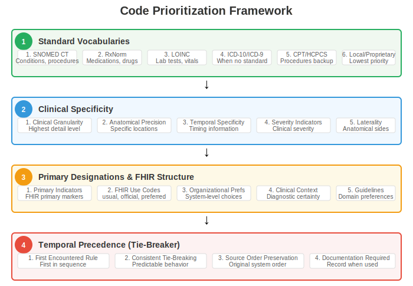
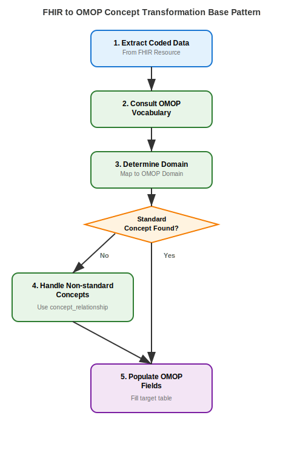
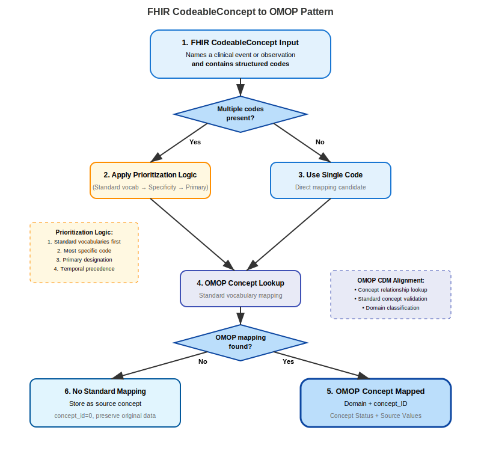

# FHIR to OMOP Coded Data Transformation Patterns
Unlike purely schema-to-schema transformations, transforming FHIR to OMOP requires evalutaion of the concepts coded in the source data to determine and assign appropriate representation in a target OMOP database. This means that FHIR resources contained in profiles such as "IPA-Condition" or "IPA-Observation" may or may not generate records on a target OMOP domain table bearing the same or similar names, such as "condition_occurrence" and "observation."  Rather, the concepts represented in the FHIR resource determine the appropriate transformation targets, and each must be evalated on a case-by-case basis. FHIR coded source data transformation to OMOP often do follow patterns where similar data sources are processed through a common series of steps to populate an OMOP target database. This standardized approach lowers the decsiion burden for ETL developers and ensures consistent handling of coded clinical information across diverse healthcare datasets.  

## Understanding Coded Source Data
Coded source data in FHIR refers to information represented using standardized code systems such as SNOMED CT, LOINC, RxNorm, and other established terminologies. (See Using Codes in Resources for more information.) When mapping these FHIR elements to OMOP, implementers must ensure that codes are appropriately translated into the OHDSI Standardized Vocabularies and that the resulting data aligns with the correct domain classifications within the OMOP model.

## Mapping Complexity and Validation
Ensuring valid mappings from different source coding systems requires careful attention to the nature of the relationships between source and target concepts. While some mappings represent true one-to-one relationships that can be transformed directly, many cases involve one-to-many relationships between a coded source and multiple OMOP target concepts. These target concepts may reside within a single domain or span multiple domains within the OMOP structure. (See Standard concepts & Domain discussion for detailed information.)

The absence of established mappings in the OHDSI Standardized Vocabularies significantly increases the risk of incorrect or ambiguous data translation. Such gaps require careful evaluation and potentially custom mapping development to maintain data integrity during the transformation process.

## Automated Mapping Support
Leveraging a terminology server (e.g.: https://echidna.fhir.org) can facilitate automated mapping processes, particularly for free text or non-standard codes, while producing consistent mapping results across transformation instances. This approach reduces manual intervention and improves the reliability of code translation activities.

The OHDSI Athena website provides both access to request OHDSI Vocabulary downloads and a comprehensive searchable database that serves dual purposes for mapping activities. Implementers can use this resource to manually browse available vocabularies and identify codes that appropriately match source concepts to Standard OMOP concepts and also receive vocabulary updates when new versions are published.  Acess to the OHDSI Standardized Vocabularies, whether via API, downloads utilized in local systems or via manual interation with the Athena serach UI is essential for validating mappings and resolving complex terminology translation challenges that arise during FHIR to OMOP transformation projects.

### Key Elements of FHIR Coded Data
Coded data in FHIR resources minimally employ a pattern specififying a code and the coding system the code is derived from, and optional display and version attributes (see: Using Codes in Resources https://www.hl7.org/fhir/terminologies.html#4.1) 

* **Code**: The actual code from a standardized code system.
* **System**: The code system from which the code is drawn (e.g., SNOMED CT, LOINC).
* **Display**: A human-readable version of the code (optional).
* **Version**: The version of the code system (optional).

The code and system elements required in FHIR are also key search parameters when identifiying target concepts in the OHDSI Standardized Vocabularies. A FHIR Code System is represented in the OMOP CDM vocabulary table as a unique identifer (vocabulary_id) with an acompanying human-readable name (vocabulary_name).  A Code or Coding in FHIR is represented in the OMOP CDM concept table as a 'concept_code', which is linked to the vocabulary table via a vocabulary_id foreign key.  

## Core Transformation Components

### Code Prioritization Framework

When multiple codes are present for a single clinical concept, implementers must apply a systematic prioritization hierarchy across all transformation patterns to ensure consistency and clinical validity. This framework addresses the complex reality of multiple coding scenarios by establishing clear precedence rules that eliminate ambiguity in code selection while ensuring reproducible transformation outcomes.

The hierarchy begins with standard vocabularies, where SNOMED CT takes priority for conditions, procedures, and clinical observations due to its comprehensive coverage and OMOP's primary reliance on SNOMED concepts. RxNorm receives precedence for medications, drug products, and pharmaceutical concepts as the standard drug vocabulary in OMOP, while LOINC takes priority for laboratory tests, measurements, and clinical observations, particularly lab results and vital signs. ICD-10 and ICD-9 codes should only be used when no standard vocabulary equivalent exists, as these are considered non-standard in OMOP but may have mappings to standard concepts. CPT and HCPCS codes are acceptable for procedures when SNOMED equivalents are not available, though these require mapping to standard concepts. Local or proprietary codes receive the lowest priority and should only be used when no standard vocabulary alternative exists.

{::options parse_block_html="false" /}
<figure>
<figcaption><b>Code Prioritization Framework</b></figcaption>

</figure>
{::options parse_block_html="true" /}

Within the framework of standard vocabulary selection, clinical specificity serves as the secondary criterion, with codes providing the highest level of clinical detail taking precedence over general classifications. This includes choosing codes that provide clinical granularity, anatomical precision that specifies exact locations when available, temporal specificity that includes timing information when relevant, severity indicators when clinically appropriate, and laterality specifications for anatomically relevant concepts. The system should consistently avoid parent concepts when more specific child concepts are available in the coding array.

The mapping process further considers explicit primary designations within the FHIR resource structure, where codes marked with primary indicators receive preference during selection. This includes honoring explicit "primary" or "preferred" designations in the FHIR coding array, respecting FHIR use codes such as "usual," "official," or "preferred" when present, considering organizational or system-level preferences for specific vocabularies when documented, factoring in clinical context where primary designation may indicate diagnostic certainty or treatment focus, and following institutional coding guidelines that may designate preferred vocabularies for specific clinical domains.

When all other factors remain equal, temporal precedence applies, selecting the first code encountered in the sequence. This first encountered rule provides consistent tie-breaking when multiple equally valid codes exist, maintains the original order of codes as provided by the source system, requires documentation when temporal precedence was the deciding factor for transparency and quality assurance, and ensures predictable behavior across all transformation instances.

### Standard OMOP Vocabulary Lookup Methodology

All transformation patterns utilize a consistent lookup approach that forms the foundation for vocabulary validation and concept identification. The lookup process involves querying the OMOP concept table to identify matching concepts based on the source code and vocabulary system, followed by comprehensive analysis of the returned results.

```sql
SELECT concept_id, concept_name, domain_id, vocabulary_id, concept_code, standard_concept
FROM concept
WHERE concept_code = '[SOURCE_CODE]' 
  AND vocabulary_id = '[VOCABULARY_ID]';
```

The lookup analysis encompasses several critical components that ensure proper concept identification and validation. Implementers must verify OMOP concept existence to confirm that the source code has a corresponding representation in the standardized vocabularies. The standard concept status requires confirmation through the presence of the 'S' flag, indicating that the concept can be used directly in OMOP analytics without requiring additional concept relationship mapping. Vocabulary alignment validation ensures that the identified concept originates from the expected terminology system and maintains semantic consistency with the source data. Domain assignment determination identifies the appropriate OMOP domain table for storing the clinical information, which may differ from expectations based solely on FHIR resource type.

This systematic lookup methodology provides the foundation for all subsequent mapping decisions and ensures consistent handling of vocabulary validation across different transformation patterns. The approach supports both automated processing and manual validation workflows, enabling implementers to maintain high data quality standards while achieving efficient transformation throughput.

### Domain Assignment Logic

Domain assignment follows a vocabulary-driven approach that prioritizes semantic accuracy over structural assumptions based on FHIR resource types. This methodology recognizes that OMOP's domain organization may differ from FHIR's resource categorization, requiring careful attention to vocabulary-based domain assignments to ensure proper analytical representation.

The primary consideration in domain assignment involves using the domain_id from the OMOP concept table as the authoritative domain assignment source. This vocabulary-driven approach ensures that clinical concepts are stored in domains that align with their semantic meaning within the OMOP ecosystem, rather than being forced into domains based solely on their originating FHIR resource type. When vocabulary domain assignments conflict with FHIR resource type expectations, the vocabulary takes precedence to maintain semantic consistency within the OMOP analytical framework.

FHIR resource type considerations serve as secondary guidance when vocabulary domain assignments are ambiguous or when multiple valid domain options exist for a particular concept. This secondary role ensures that transformation logic can fall back to resource type expectations while maintaining the priority of vocabulary-driven domain assignment. Clinical context application becomes necessary when domain assignments conflict with expected clinical meaning, requiring implementer judgment to resolve semantic inconsistencies that may arise from vocabulary evolution or mapping edge cases.

This domain assignment logic ensures that transformed data maintains semantic accuracy within the OMOP ecosystem while acknowledging the structural differences between FHIR's resource-based organization and OMOP's domain-based analytical model. The approach supports both automated transformation workflows and manual review processes for complex or ambiguous domain assignment scenarios.

### Source Value Preservation: A Best Practice

Comprehensive source value preservation forms a critical component of FHIR to OMOP transformation, ensuring data lineage maintenance, supporting future remapping efforts, and enabling quality assurance validation. This preservation strategy recognizes that vocabulary evolution and improved mapping algorithms may require reprocessing of source data, making original value retention essential for long-term data management.

Source value fields must always preserve original codes exactly as provided in FHIR resources, maintaining character-for-character accuracy to ensure complete traceability back to the source system. This preservation includes maintaining any formatting, spacing, or special characters present in the original codes, as these may carry semantic meaning or system-specific significance that could be relevant for future processing or validation efforts.

Source concept ID fields require population with OMOP concept_id values when source codes exist within the standardized vocabularies, while unmapped codes receive the value 0 to indicate their non-standard status. This approach provides clear indication of mapping status while maintaining the relationship between source codes and their OMOP representations when available. The use of 0 for unmapped codes follows OMOP conventions and enables analytical queries to distinguish between successfully mapped and unmapped source data.

Audit trail maintenance encompasses complete transformation lineage documentation, including mapping decisions, prioritization choices, and any manual interventions performed during the transformation process. This documentation enables future validation efforts, supports quality improvement initiatives, and provides the foundation for remapping activities when vocabulary updates or improved algorithms become available.

Future-proofing considerations involve designing storage and documentation strategies that accommodate vocabulary evolution, improved mapping methodologies, and changing clinical terminology standards. This includes maintaining flexible data structures that can accommodate additional mapping metadata, preserving sufficient context for understanding original transformation decisions, and ensuring that source preservation strategies support both automated and manual remapping processes.

### Standard OMOP Field Population Template

Consistent field population across all domain tables ensures standardized transformation outcomes and supports reliable analytical processes. This template structure provides the foundation for populating OMOP domain tables while maintaining semantic accuracy and preserving essential data lineage information.

The concept ID field receives values from OMOP vocabulary lookup results, specifically using standard concepts identified through the vocabulary validation process. This field represents the primary analytical key for the clinical concept and must contain valid OMOP concept identifiers that correspond to standard vocabularies within the appropriate domain. When source codes map to non-standard concepts, concept relationship traversal may be required to identify the appropriate standard concept for analytical use.

Source value fields preserve original FHIR code elements exactly as provided in the source system, maintaining complete fidelity to the original clinical documentation. This preservation includes any formatting, case sensitivity, or special characters present in the source codes, ensuring that future validation or remapping efforts have access to the complete original context. The source value serves as the definitive reference for understanding what was actually documented in the source clinical system.

Source concept ID fields contain OMOP concept identifiers when source codes exist within the standardized vocabularies, or the value 0 when source codes are not present in OMOP vocabularies. This field provides explicit indication of the mapping status for the source code and enables analytical queries to distinguish between different types of source code relationships within the OMOP ecosystem.

Temporal fields extract date and datetime information from appropriate FHIR elements, ensuring that clinical timing information is preserved and properly formatted for OMOP analytical requirements. This includes handling various FHIR date formats, managing time zone considerations when present, and ensuring that temporal precision is maintained according to the source data quality and availability.

Person identification fields resolve FHIR subject references to establish proper linkage with OMOP person records, ensuring that clinical information is correctly associated with individual patients within the analytical database. This resolution process must maintain referential integrity while supporting privacy and security requirements that may govern patient identification within the OMOP implementation.

## Mapping Process Patterns
As stated previously, mapping coded data from FHIR to OMOP requires evaluation of the concepts to be stored in tables on OMOP, and these transformations follow distinct patterns.  In this IG, we propose transformation patterns and guidance regarding: 

* A base pattern that covers most simple code to concept transformation
* A pattern applicable to many Codeable Concepts
* Value-as-concept map patterns 
* One source to many OMOP target domains 
* Multiple source reference evaluations
* OMOP non-Standard concept source coding
* Historical code and code system transformations

## FHIR to OMOP Base Mapping Pattern

{::options parse_block_html="false" /}
<figure>
<figcaption><b>FHIR to OMOP Coded Data Base Mapping Pattern</b></figcaption>

</figure>
{::options parse_block_html="true" /}

### Pattern 1: Base Mapping Pattern

The foundational pattern for simple code-to-concept transformations provides the essential framework that underlies all other transformation approaches. This pattern addresses the most straightforward scenarios where FHIR resources contain single, well-defined codes that can be directly mapped to OMOP standard concepts without requiring complex prioritization or decomposition logic.

The base mapping process begins with extracting coded data from FHIR resources, focusing on identifying coded elements of the type CodeableConcept or Coding within the resource structure. This extraction phase requires careful attention to the location and structure of coded elements, as they may appear in different fields depending on the FHIR resource type and profile being processed. The extraction process must capture not only the code values themselves but also the associated system identifiers and any relevant metadata that may influence the mapping process.

Following code extraction, the transformation applies the Universal Code Prioritization Framework when multiple codes exist within the source data. Even in base mapping scenarios, multiple codes may be present due to system interoperability requirements or legacy data migration processes. The prioritization framework ensures consistent selection logic that favors standard vocabularies, clinical specificity, and explicit primary designations while providing fallback mechanisms for edge cases.

The vocabulary lookup phase applies the Standard OMOP Vocabulary Lookup Methodology to identify corresponding OMOP concepts for the selected source codes. This critical step validates that source codes have appropriate representations within the OHDSI Standardized Vocabularies and determines whether direct mapping is possible or if concept relationship traversal is required for non-standard source codes.

Domain determination utilizes the Domain Assignment Logic to identify the appropriate OMOP domain table for storing the clinical information. This step recognizes that vocabulary-driven domain assignment may differ from assumptions based solely on FHIR resource types, ensuring that clinical concepts are stored in semantically appropriate locations within the OMOP analytical framework.

Non-standard concept handling addresses scenarios where source codes map to non-standard OMOP concepts, requiring traversal of the concept_relationship table to identify appropriate standard concepts for analytical use. This process maintains the connection between source codes and their standard representations while preserving the original mapping context for audit and validation purposes.

The final population phase applies the Standard OMOP Field Population Template to ensure consistent data storage across all transformation instances. This standardization supports reliable analytical processes while maintaining essential data lineage information for quality assurance and future enhancement efforts.

#### Example: Diabetes Condition Mapping

Consider a straightforward diabetes diagnosis represented in a FHIR Condition resource with a single SNOMED CT code. The source resource demonstrates the ideal scenario for base pattern transformation, containing clear coded information without ambiguity or complex relationships.

```json
{
  "resourceType": "Condition",
  "id": "example",
  "code": {
    "coding": [
      {
        "system": "http://snomed.info/sct",
        "code": "44054006",
        "display": "Diabetes mellitus type 2"
      }
    ]
  },
  "subject": {
    "reference": "Patient/example"
  },
  "onsetDateTime": "2011-05-24"
}
```

The transformation process identifies SNOMED CT code 44054006 within the CodeableConcept structure, recognizing it as a single, well-defined concept suitable for direct mapping. Vocabulary lookup confirms that this code maps to OMOP concept_id 201826 with standard concept status, eliminating the need for concept relationship traversal. Domain assignment validation confirms that the concept resides in the Condition domain, aligning with the FHIR resource type and supporting storage in the condition_occurrence table.

```sql
INSERT INTO condition_occurrence (
    condition_occurrence_id,
    person_id,
    condition_concept_id,
    condition_start_date,
    condition_source_value,
    condition_source_concept_id,
    condition_type_concept_id
) VALUES (
    [generated_id],
    [mapped_person_id],
    201826,                -- Standard OMOP concept
    '2011-05-24',
    '44054006',           -- Source preservation
    201826,               -- Source concept (already standard)
    32020                 -- EHR record type
);
```

This example demonstrates the straightforward application of the base pattern, showcasing direct vocabulary mapping, domain alignment, and comprehensive source preservation. The transformation maintains clinical accuracy while conforming to OMOP analytical requirements, providing a foundation for understanding more complex transformation scenarios.

## Field Mapping Details

| OMOP Field | Value | Source | Transformation Notes |
|------------|--------|---------|---------------------|
| `condition_concept_id` | 201826 | OMOP vocabulary lookup | Standard concept from Step 2 |
| `condition_source_value` | 44054006 | FHIR code.coding[0].code | Original source code preserved |
| `condition_source_concept_id` | 201826 | Same as standard concept | Source code already standard |
| `condition_start_date` | 2011-05-24 | FHIR onsetDateTime | Date extracted from FHIR |
| `person_id` | [mapped_person_id] | FHIR subject reference | Patient reference resolution |


The example above represents a straightforward transformation scenario with a direct vocabulary match and domain alignment. Real-world implementations should prepare for more complex scenarios involving non-standard vocabularies, domain mismatches, and mapping gaps, but this base pattern provides the foundational framework for handling all transformation cases systematically and consistently.

### Pattern 2: CodeableConcept Multi-Code Pattern

The CodeableConcept pattern addresses the challenge of transforming FHIR CodeableConcept elements that may contain multiple codes, free text, or combinations of both. This pattern recognizes the tension between FHIR's flexibility in representing clinical concepts and OMOP's requirement for standardized, unambiguous concept identification. The approach provides systematic methodology for handling the complexity inherent in CodeableConcept structures while preserving clinical meaning and maintaining data quality standards.

CodeableConcept elements in FHIR can contain multiple coding entries, each potentially representing the same clinical concept through different terminology systems or at different levels of granularity. This multiplicity creates opportunities for enhanced semantic representation but also introduces complexity in determining which code should serve as the primary mapping target for OMOP transformation. The pattern addresses this complexity through sophisticated assessment and prioritization logic that ensures consistent, reproducible transformation outcomes.

{::options parse_block_html="false" /}
<figure>
<figcaption><b>FHIR CodeableConcept to OMOP Pattern</b></figcaption>

</figure>
{::options parse_block_html="true" /}

The transformation process begins with assessing code multiplicity within the CodeableConcept structure, determining whether multiple structured codes exist and evaluating their relationships to each other. When multiple codes are present, the system applies the Universal Code Prioritization Framework to select the most appropriate code for OMOP mapping, considering vocabulary precedence, clinical specificity, primary designations, and temporal factors.

For CodeableConcepts containing only single structured codes, the process bypasses complex prioritization logic and proceeds directly to vocabulary lookup and domain assignment. This streamlined approach recognizes that single codes represent the ideal scenario for FHIR-to-OMOP transformation, eliminating ambiguity while maintaining data integrity and processing efficiency.

The vocabulary lookup phase applies standard methodology to identify corresponding OMOP concepts, with particular attention to domain assignment that may differ from FHIR resource type expectations. This vocabulary-driven approach ensures that clinical concepts are stored in semantically appropriate OMOP domains, even when this conflicts with structural assumptions based on FHIR resource categorization.

Context preservation becomes particularly important in CodeableConcept transformation, as free text elements may contain valuable clinical information that supplements or clarifies the coded representations. The pattern provides mechanisms for preserving this contextual information in appropriate OMOP fields, ensuring that clinical nuance is not lost during the transformation process.

## Example: Mapping No Known Allergy CodeableConcept

The transformation of negative assertion concepts demonstrates the importance of vocabulary-driven domain assignment in CodeableConcept processing. Consider an AllergyIntolerance resource that documents the absence of known allergies, representing a clinical concept that challenges traditional resource-to-domain mapping assumptions.

```json
{
  "resourceType": "AllergyIntolerance",
  "id": "no-known-allergy-example",
  "code": {
    "coding": [
      {
        "system": "http://snomed.info/sct",
        "code": "716186003",
        "display": "No known allergy (situation)"
      }
    ],
    "text": "NKA"
  },
  "patient": {
    "reference": "Patient/example"
  },
  "recordedDate": "2023-01-15"
}
```
The CodeableConcept contains a single SNOMED CT code representing a standardized approach to expressing the absence of known allergies, supplemented by free text that provides additional clinical context. Vocabulary lookup reveals that SNOMED CT code 716186003 maps to OMOP concept_id 4222295, but critically, this concept resides in the Observation domain rather than the Condition domain that might be expected based on the AllergyIntolerance resource type.

This domain assignment reflects OMOP's semantic organization, where negative assertions about clinical conditions are typically modeled as observations rather than conditions themselves. The vocabulary-driven domain assignment takes precedence over resource type expectations, demonstrating the importance of semantic accuracy in OMOP transformation processes.

```sql
INSERT INTO observation (
    observation_id,
    person_id,
    observation_concept_id,
    observation_date,
    observation_source_value,
    qualifier_source_value
) VALUES (
    [generated_id],
    [mapped_person_id],
    4222295,              -- No known allergy concept
    '2023-01-15',
    '716186003',         -- Source preservation
    'NKA'                -- Free text context preserved
);
```

The transformation successfully preserves both the structured coded information and the free text context while ensuring appropriate domain assignment based on vocabulary semantics. This example illustrates the critical importance of vocabulary-driven transformation logic and the value of preserving contextual information that supplements coded clinical data.

### Field Mapping Details

| OMOP Field | Value | Source | Transformation Notes |
|------------|--------|---------|---------------------|
| `observation_concept_id` | 4222295 | SNOMED 716186003 | Standard OMOP concept for "No known allergy" |
| `observation_source_value` | 716186003 | FHIR code.coding[0].code | Original SNOMED code preserved |
| `observation_source_concept_id` | 4222295 | Same as standard | Source code already standard |
| `observation_date` | 2023-01-15 | FHIR recordedDate | Date of allergy status documentation |
| `qualifier_source_value` | NKA | FHIR code.text | Free text abbreviation preserved |
| `value_as_concept_id` | NULL | Not applicable | No additional value needed for status assertion |

In this example, the transformation successfully followed the proposed pattern, beginning with identification of the CodeableConcept input containing a negative assertion concept for "No known allergy." Since only a single SNOMED CT code was present in the coding array, the system  can bypass the prioritization logic step. An OMOP vocabulary lookup located the concept with an unexpected domain revelation - the concept mapped to the Observation domain rather than the anticipated Condition domain based on the source IPA AllergyIntolerance profile. In this onstance, there a need to complete an additional stpe was elminiated, as a standard OMOP concept was found and could be used directly.

The transformation revealed several key insights about handling negative assertion concepts in OMOP. The vocabulary domain assignment took precedence over FHIR resource type expectations, demonstrating that OMOP's semantic organization may differ from FHIR's resource categorization. This required routing the data to the observation table instead of condition_occurrence, while preserving the clinical context through the qualifier_source_value field containing the "NKA" abbreviation.

Although prioritization was not required due to the single code scenario, the transformation validated adherence to the established hierarchy. SNOMED was confirmed as the highest priority standard vocabulary, and the concept's standard status (S flag) allowed for direct usage without additional relationship mapping. As the text provided is an exact match to the preferred term in SNOMED, "No known allergy (situation)" with the SNOMED situational concept effectively capturing the clinical meaning of a negative assertion about allergy status is appropriately accepted.

Concept relationship verification using the standard query pattern validated the concept's position within the vocabulary hierarchy, while domain classification logic demonstrated how OMOP vocabulary domain assignments take precedence over FHIR resource type expectations. The AllergyIntolerance resource type initially suggested a Condition domain mapping, but the vocabulary's assignment to the Observation domain guided the final table selection decision. Standard concept validation confirmed the S flag status, eliminating the need for concept relationship mapping and approving direct usage in the observation_concept_id field. This vocabulary-driven approach ensures semantic consistency within the OMOP ecosystem while preserving the clinical intent of the original FHIR data.

## Alternative Scenario: Multiple Allergy Status Codes
If the CodeableConcept contained both SNOMED and a local code:

```json
"coding": [
  {
    "system": "http://snomed.info/sct",
    "code": "716186003",
    "display": "No known allergy (situation)"
  },
  {
    "system": "http://hospital.org/allergy-codes",
    "code": "NKA-001",
    "display": "No Known Allergies"
  }
]
```

**Prioritization Application:**
- **Standard Vocabulary First**: SNOMED CT selected over local code
- **Result**: Same mapping to concept_id 4222295
- **Local Code**: Preserved in observation_source_value as secondary

### Scenario B: Related Allergy Concepts
Similar concepts that might appear in allergy contexts:

| SNOMED Code | Concept Name | OMOP Domain | Notes |
|-------------|--------------|-------------|-------|
| 716186003 | No known allergy | Observation | Status assertion |
| 429625007 | No known food allergy | Observation | Specific category |
| 428607008 | No known environmental allergy | Observation | Environmental focus |
| 409137002 | No known drug allergy | Observation | Medication-specific |

All these concepts map to the Observation domain, maintaining consistency in OMOP representation. A concept-based domain mapping strategy is the fundamental consideration when OMOP vocabulary domain assignments differ from FHIR resource type expectations. 

The "absence of" semantics in these examples must be maintained in the target OMOP representation, ensuring that negative assertions remain clearly identifiable for clinical and research purposes. This preservation is critical because negative assertions significantly impact analytics queries - researchers must understand when "no known allergy" represents confirmed absence versus lack of documentation. Implementing robust temporal validity tracking becomes essential, as the timing of negative assertions affects their clinical relevance and validity periods. If manual mapping or hard-coded ETL processes are employed in FHIR to OMOP concpet mapping, clinical review processes must validate that OMOP representations accurately reflect the original clinical meaning, especially for concepts as are present in these examples that challenge traditional condition-versus-observation boundaries. Completeness checking ensures that all allergy status information is captured appropriately, while consistency monitoring tracks domain assignment patterns for similar concepts to identify potential mapping inconsistencies or opportunities for standardization across the implementation.

These "No Known Allergy" example demonstrates several critical aspects of FHIR CodeableConcept to OMOP transformation:

1. **Domain Complexity**: OMOP vocabulary domain assignment may differ from FHIR resource type expectations
2. **Negative Assertions**: Absence-of-condition concepts require special consideration in clinical data mapping
3. **Table Selection**: Proper OMOP table selection depends on vocabulary domain, not source resource type
4. **Context Preservation**: Free text elements provide valuable clinical context that should be preserved

The transformation successfully maps a common clinical concept while revealing the importance of vocabulary-driven domain assignment in OMOP implementations. This pattern applies to many similar negative assertion concepts in clinical documentation, providing a template for handling absence-of-finding scenarios in FHIR to OMOP transformations.

## Free Text in CodeableConcept Mapping

Free text mapping addresses the transformation of unstructured text into Standard OMOP concepts. CodeableConcept with free-text descriptions lacking corresponding coded elements, require manual review or natural language processing to extract and standardize clinical concepts. This description provides an approach for converting text in FHIR CodeableConcept elements into OMOP-compatible structured data while preserving clinical meaning.

According to FHIR specification, the `text` element represents "the concept as entered or chosen by the user, and which most closely represents the intended meaning." The text often matches the display value of associated codings but may contain user-specific terminology or local clinical language. When codings are marked with `coding.userSelected = true`, this indicates the clinician's preferred representation. When no coding is user-selected, the text element becomes the preferred source of clinical meaning for transformation.

FHIR permits text-only representations when no appropriate standardized code exists:

```json
"valueCodeableConcept": {
    "text": "uncoded free text result"
}
```

These scenarios present the greatest transformation challenge, requiring manual mapping, comprehensive NLP analysis or explicit handling on OMOP as an unmapped source data. Unmapped content receives concept_id=0 with complete source text preservation in _source_value fields. Complex narratives may generate multiple OMOP records from single text sources, with temporal and contextual information influencing concept selection and date assignments.

## CodeableConcept Free Text Mapping Examples

### 1. Text with User-Selected Coding
**Source Text**: "Type 2 diabetes"
**Associated Coding**: SNOMED 44054006 with userSelected=true
**Transformation**: Use coded concept (201826) while preserving text in source_value

*OMOP Condition Record:*
```sql
INSERT INTO condition_occurrence (
    condition_occurrence_id,
    person_id,
    condition_concept_id,
    condition_start_date,
    condition_start_datetime,
    condition_type_concept_id,
    condition_source_value,
    condition_source_concept_id
) VALUES (
    12345,                                     -- condition_occurrence_id
    67890,                                     -- person_id
    201826,                                    -- condition_concept_id (Type 2 diabetes mellitus)
    '2024-03-15',                             -- condition_start_date
    '2024-03-15T10:30:00',                    -- condition_start_datetime
    32817,                                     -- condition_type_concept_id (EHR)
    'Type 2 diabetes',                         -- condition_source_value (original text)
    201826                                     -- condition_source_concept_id (same as standard)
);
```

### 2. Ambiguous Clinical Language
**Source Text**: "Patient has diabetes"
**Challenge**: Unspecified diabetes type
**Mapping Strategy**: Map to general diabetes concept with quality flag for specificity limitation

*OMOP Condition Record:*
```sql
INSERT INTO condition_occurrence (
    condition_occurrence_id,
    person_id,
    condition_concept_id,
    condition_start_date,
    condition_start_datetime,
    condition_type_concept_id,
    condition_source_value,
    condition_source_concept_id,
    qualifier_source_value
) VALUES (
    12346,                                     -- condition_occurrence_id
    67890,                                     -- person_id
    201820,                                    -- condition_concept_id (Diabetes mellitus)
    '2024-03-15',                             -- condition_start_date
    '2024-03-15T10:30:00',                    -- condition_start_datetime
    32817,                                     -- condition_type_concept_id (EHR)
    'Patient has diabetes',                    -- condition_source_value (original text)
    0,                                         -- condition_source_concept_id (unmapped source)
    'LOW_SPECIFICITY'                          -- qualifier_source_value (quality flag)
);
```

### 3. Medical Abbreviations
**Source Text**: "Pt w/ h/o MI, now c/o SOB"
**NLP Processing**: 
- "h/o MI" → "history of myocardial infarction"
- "c/o SOB" → "complains of shortness of breath"
**Result**: Two distinct condition records

*OMOP Condition Record 1 - History of MI:*
```sql
INSERT INTO condition_occurrence (
    condition_occurrence_id,
    person_id,
    condition_concept_id,
    condition_start_date,
    condition_start_datetime,
    condition_type_concept_id,
    condition_source_value,
    condition_source_concept_id,
    qualifier_source_value
) VALUES (
    12347,                                     -- condition_occurrence_id
    67890,                                     -- person_id
    4329847,                                   -- condition_concept_id (Myocardial infarction)
    '2024-03-15',                             -- condition_start_date
    '2024-03-15T10:30:00',                    -- condition_start_datetime
    32817,                                     -- condition_type_concept_id (EHR)
    'h/o MI',                                  -- condition_source_value (original abbreviation)
    0,                                         -- condition_source_concept_id (unmapped source)
    'HISTORY_OF'                               -- qualifier_source_value (temporal qualifier)
);
```

*OMOP Observation Record - Current SOB Complaint:*
```sql
INSERT INTO observation (
    observation_id,
    person_id,
    observation_concept_id,
    observation_date,
    observation_datetime,
    observation_type_concept_id,
    observation_source_value,
    observation_source_concept_id,
    qualifier_source_value
) VALUES (
    54321,                                     -- observation_id
    67890,                                     -- person_id
    4000045,                                   -- observation_concept_id (Dyspnea)
    '2024-03-15',                             -- observation_date
    '2024-03-15T10:30:00',                    -- observation_datetime
    32817,                                     -- observation_type_concept_id (EHR)
    'c/o SOB',                                -- observation_source_value (original abbreviation)
    0,                                         -- observation_source_concept_id (unmapped source)
    'PATIENT_COMPLAINT'                        -- qualifier_source_value (clinical context)
);
```

### Example CodeableConcept Free Text Field Mapping Summary 

| Scenario | OMOP Field | Value | Transformation Notes |
|----------|------------|-------|---------------------|
| **User-Selected Coding** | condition_concept_id | 201826 | Direct mapping from userSelected SNOMED code |
| | condition_source_concept_id | 201826 | Source code already standard |
| | condition_source_value | "Type 2 diabetes" | Preserves user-entered text |
| **Ambiguous Language** | condition_concept_id | 201820 | General diabetes concept due to ambiguity |
| | condition_source_concept_id | 0 | No source coding available |
| | qualifier_source_value | "LOW_SPECIFICITY" | Quality flag for clinical review |
| **Medical Abbreviations** | condition_concept_id | 4329847 | MI mapped to standard concept |
| | observation_concept_id | 4000045 | SOB mapped to dyspnea concept |
| | qualifier_source_value | "HISTORY_OF", "PATIENT_COMPLAINT" | Temporal and clinical context preserved |

## FHIR to OMOP Value-as-Concept Map Pattern
Drug allergies represent a complex transformation challenge in FHIR-to-OMOP mapping due to their composite nature. In FHIR, an AllergyIntolerance resource typically contains a coded element representing both the allergy type and the specific substance.  This is not aligned with OMOP's preference for decomposed, granular concept representation. The Value-as-Comcept Map pattern addresses the tension between FHIR's composite coding approach and OMOP's value-as-concept methodology, which separates the observation type (allergy classification) from the specific substance causing the reaction.

### FHIR to OMOP Value as Concept Pattern: Drug Allergy
{::options parse_block_html="false" /}
<figure>
<figcaption><b>FHIR to OMOP Value as Concept Map Pattern</b></figcaption>

</figure>
{::options parse_block_html="true" /}

#### 1: FHIR AllergyIntolerance Input
FHIR AllergyIntolerance resources contain coded elements in the `code` field that often represent composite concepts combining both the allergy type and the specific substance. For drug allergies, this typically appears as structured codes like "Allergy to benzylpenicillin" (SNOMED CT: 294930007), which contains both the allergic reaction classification and the specific pharmaceutical substance. This pattern assumes the presence of structured codes that can be semantically decomposed.  We are deliberately excluding free-text-only allergy descriptions in this example, as these pose an array of differnt mapping challenges.

#### 2: Decompose for Mapping Analysis
The system analyzes the composite concept to determine whether it can be meaningfully separated into constituent parts: an observation concept representing the allergy type and a value concept representing the specific substance. This decomposition process examines the semantic structure of codes like "Allergy to [substance]" to identify patterns suitable for value-as-concept transformation. The analysis considers whether both components (allergy type and substance) have equivalent representations in OMOP standard vocabularies, ensuring that the clinical meaning remains intact through the transformation process.

**Decision Point: Decomposition Available as OMOP Standard Concepts?**

If the composite concept can be successfully decomposed into standard OMOP concepts for both the observation type and the substance value, the system proceeds with the value-as-concept approach. If decomposition is not possible or would result in loss of clinical meaning, the system routes to manual mapping alternatives.

#### 3a: Apply Value as Concept
When decomposition is successful, the system or ETL script applies the value-as-concept pattern by mapping the allergy type to `observation_concept_id` and the specific substance to `value_as_concept_id`. For example, "Allergy to benzylpenicillin" decomposes to:
- **observation_concept_id**: 439224 ("Allergy to drug")
- **value_as_concept_id**: 1728416 ("Penicillin G")

This approach maintains the semantic relationship while enabling both general allergy queries and substance-specific analytics within the OMOP framework.

#### 3b: Manual Mapping
When automatic decomposition fails or results in unmappable components, manual decomposition and mapping may be required to preserve clinical meaning while adhering to OMOP principles. This may involve identifying alternative standard concepts that capture the essential clinical information or creating source concept mappings that maintain traceability to the original FHIR data.

#### 4: OMOP Vocabulary Lookup
The decomposed concepts undergo validation against OHDSI Standardized Vocabularies to confirm that both the observation concept and value concept exist as Standard OMOP concepts. This critical validation step ensures that the mapped concepts upoholds the OMOP conventions for Standard concept alignment withtin each Domian (** See disccusion of OMOP Standard Concpets here**) and will integrate properly with OMOP-based analytics tools. The lookup process verifies concept status, domain assignment, and relationship mappings.

**Decision Point: All Concepts Found in OMOP?**

If both the observation concept and value concept are confirmed as standard OMOP concepts, the system proceeds to populate the appropriate OMOP domain table(s). If either concept is missing or non-standard, the system should identify vocabulary gaps and consider alternative mapping strategies.

#### 5a: Populate Appropriate OMOP Domain
When all concepts are successfully validated, the system populates the OMOP Observation domain using the value-as-concept pattern:
- **concept_id**: 439224 (Allergy to drug) - assigned to Observation Domain
- **value_as_concept_id**: 1728416 (Penicillin G)

#### 5b: Identify Vocabulary Gap
If mapping to OMOP Standard concepts mappings is not possible, the system should document missing concepts and consider local extensions for missing source concepts. This process maintains data completeness while clearly indicating limitations for OMOP-based analytics. The system then should preserve the original source values and creates mappings to concept_id=0, following OMOP best practices for handling unmapped data.

#### 6: Optional: Handle Reactions
For comprehensive allergy documentation, the system can create linked observations for allergic reactions using `observation_event_id` to maintain the relationship between the allergen and the specific reaction manifestations. This optional step enables detailed reaction tracking while preserving the primary allergy-substance relationship established through the value-as-concept pattern.

#### 7: Map Quality Validation
The transformation process includes verification that clinical meaning is preserved and value concept alignment maintains semantic accuracy. This validation ensures that the decomposed representation accurately reflects the original clinical intent while conforming to OMOP analytical requirements.

## Example Mapping: SNOMED 294930007

**Source FHIR AllergyIntolerance Resource**
```json
{
  "resourceType": "AllergyIntolerance",
  "id": "penicillin-allergy-example",
  "clinicalStatus": {
    "coding": [
      {
        "system": "http://terminology.hl7.org/CodeSystem/allergyintolerance-clinical",
        "code": "active"
      }
    ]
  },
  "code": {
    "coding": [
      {
        "system": "http://snomed.info/sct",
        "code": "294930007",
        "display": "Allergy to benzylpenicillin"
      }
    ]
  },
  "patient": {
    "reference": "Patient/example"
  },
  "recordedDate": "2024-03-15"
}
```

### Step-by-Step Value as Concept Transformation

**1: FHIR AllergyIntolerance Input**
- **Resource Type**: AllergyIntolerance
- **Coded Element**: code.coding[0]
- **Source System**: SNOMED CT (http://snomed.info/sct)
- **Composite Concept**: 294930007 ("Allergy to benzylpenicillin")
- **Clinical Meaning**: Drug allergy with specific pharmaceutical substance

**2: Decompose for Mapping Analysis**
- **Composite Analysis**: "Allergy to benzylpenicillin" contains both allergy type and substance
- **Semantic Pattern**: "Allergy to [substance]" pattern identified
- **Decomposition Target**: Separate allergy classification from pharmaceutical substance
- **Decision**: Decomposition possible with standard OMOP concepts

**3a: Apply Value as Concept**
- **Observation Component**: "Allergy to drug" → OMOP concept lookup required
- **Value Component**: "benzylpenicillin" → OMOP concept lookup required
- **Pattern Applied**: Value-as-concept methodology
- **Semantic Preservation**: Clinical meaning maintained through decomposition

**4: OMOP Vocabulary Lookup**

*Observation Concept Query:*
```sql
SELECT concept_id, concept_name, domain_id, vocabulary_id, standard_concept
FROM concept
WHERE concept_name LIKE '%Allergy to drug%'
  AND vocabulary_id = 'SNOMED'
  AND standard_concept = 'S';
```

*Query Results - Observation Concept:*
- **concept_id**: 439224
- **concept_name**: Allergy to drug
- **domain_id**: Observation
- **vocabulary_id**: SNOMED
- **standard_concept**: S

*Value Concept Query:*
```sql
SELECT concept_id, concept_name, domain_id, vocabulary_id, standard_concept
FROM concept
WHERE concept_name LIKE '%Penicillin G%'
  AND vocabulary_id IN ('RxNorm', 'SNOMED')
  AND standard_concept = 'S';
```

*Query Results - Value Concept:*
- **concept_id**: 1728416
- **concept_name**: Penicillin G
- **domain_id**: Drug
- **vocabulary_id**: RxNorm
- **standard_concept**: S

**5a: Populate Appropriate OMOP Domain**

*Observation Table Mapping:*
```sql
INSERT INTO observation (
    observation_id,
    person_id,
    observation_concept_id,
    observation_date,
    observation_datetime,
    observation_type_concept_id,
    value_as_concept_id,
    observation_source_value,
    observation_source_concept_id,
    value_source_value
) VALUES (
    [generated_id],                    -- observation_id
    [mapped_person_id],                -- person_id
    439224,                            -- observation_concept_id (Allergy to drug)
    '2024-03-15',                      -- observation_date
    '2024-03-15T00:00:00',            -- observation_datetime
    32817,                             -- observation_type_concept_id (EHR)
    1728416,                           -- value_as_concept_id (Penicillin G)
    '294930007',                       -- observation_source_value
    4222295,                           -- observation_source_concept_id
    'benzylpenicillin'                 -- value_source_value
);
```

### Field Mapping Details

| OMOP Field | Value | Source | Transformation Notes |
|------------|-------|--------|---------------------|
| observation_concept_id | 439224 | Decomposed from SNOMED 294930007 | Standard concept for "Allergy to drug" |
| value_as_concept_id | 1728416 | Decomposed from SNOMED 294930007 | Standard concept for "Penicillin G" |
| observation_source_value | 294930007 | FHIR code.coding[0].code | Original composite SNOMED code preserved |
| value_source_value | benzylpenicillin | FHIR code.coding[0].display | Substance component preserved |
| observation_date | 2024-03-15 | FHIR recordedDate | Date of allergy documentation |


The value-as-concept pattern supports analytical capabilities that extend beyond simple direct concept mapping approaches. This Pattern applied to drug allergies demonstrates several strong points in support of FHIR-to-OMOP data transformation. The decomposition step supports alignment with the OMOP CDM and detailed analytics by separating a composite clinical concept into analytically useful atomic components while preserving source semantics. Using the target observation concept (439224 - "Allergy to drug") in a analytics database enables population-level allergy surveillance, while splitting-out the value concept (1728416 - "Penicillin G") supports medication-specific contraindication checking. 

Utilizing an OMOP datastore, this mapping approach enables comprehensive population-level allergy surveillance through queries that identify all drug allergies regardless of the specific causative substance, while simultaneously supporting granular substance-specific contraindication checking that can pinpoint allergies to particular medications or entire drug classes. The Value-as-Concept Pattern facilitates cross-domain analytics by establishing relationships between drug allergies and other clinical observations within the OMOP ecosystem creating opportunities for epidemiological studies. 

Once again, this is an example the effectiveness of vocabulary-driven mapping over resource-type assumptions: with OMOP concept relationships taking precedence in determining the final analytical structure. Employment of source value preservation best practice ensures traceability back to the original FHIR data while enabling future remapping as vocabularies evolve.


## One Source to many OMOP targets
Multiple reference codings occur when a single clinical concept in the source FHIR data is represented by multiple codes, either within the same coding system or across different coding systems.


## Multiple FHIR Reference Codings to OMOP 
The transformation of FHIR resources to the OMOP CDM frequently presents scenarios where a single clinical concept on OMOP contains multiple codes within the FHIR resource structure.  This scenario introduces complexity in the mapping process because it requires determining which code (or codes) should be used to represent the concept in the OMOP CDM. The mapping workflow begins with comprehensive identification of all coding elements within the FHIR resource, specifically extracting codes from the CodeableConcept.coding array structure. Each code requires documentation of its associated coding system through the system URI, along with any explicit ranking or preference indicators present in the source data.

To ensure consistency and clinical validity implementers must apply selection logic identical to guidance provided for for CodeableConcepts. The hierarchy begins with standard vocabularies, where SNOMED CT, LOINC, and other OMOP-recognized terminologies take precedence over proprietary or legacy coding systems. Within this framework, clinical specificity serves as the secondary criterion, with more detailed diagnostic or procedural codes preferred over general classifications. The mapping process further considers explicit primary designations within the FHIR resource structure, where codes marked with primary indicators receive preference during selection. When all other factors remain equal, temporal precedence applies, selecting the first code encountered in the sequence. This systematic approach ensures reproducible results while maintaining the clinical intent of the original data.

Once the primary code is selected, the system should performs concept mapping to identify the corresponding Stndard OMOP concept_id. When direct mapping is unavailable, the system should map to the closest parent concept while maintaining detailed documentation of all mapping decisions for audit and quality assurance purposes.

Consider the following scenario where FHIR data contains multiple coding systems representing the same clinical concept. When encountering a diagnosis with both ICD-10 and SNOMED CT codes in the coding array, the selection process prioritizes the SNOMED CT code as the preferred standard vocabulary:

```json
{
  "code": {
    "coding": [
      {
        "system": "http://hl7.org/fhir/sid/icd-10-cm",
        "code": "E11.9",
        "display": "Type 2 diabetes mellitus without complications"
      },
      {
        "system": "http://snomed.info/sct",
        "code": "44054006",
        "display": "Type 2 diabetes mellitus"
      }
    ]
  }
}
```

In this case, the system selects SNOMED CT code 44054006 for mapping to OMOP concept ID 201826, ensuring consistency with OMOP CDM preferences while maintaining the clinical accuracy of the original diagnosis.

Another frequent situation involves multiple codes from the same coding system with varying specificity levels. When FHIR data includes both specific and general diagnostic codes, the system selects the more specific code to preserve detailed clinical information:

```json
{
  "code": {
    "coding": [
      {
        "system": "http://snomed.info/sct",
        "code": "44054006",
        "display": "Type 2 diabetes mellitus"
      },
      {
        "system": "http://snomed.info/sct",
        "code": "11687002",
        "display": "Diabetes mellitus"
      }
    ]
  }
}
```

This selection preserves the detailed clinical information while avoiding the loss of diagnostic precision during the mapping process, with the more specific code 44054006 taking precedence over the general term.

The implementation also addresses scenarios where FHIR resources explicitly designate primary codes through metadata indicators. When the coding array contains multiple codes with one marked as primary, the selection process honors this designation:

```json
{
  "code": {
    "coding": [
      {
        "system": "http://snomed.info/sct",
        "code": "44054006",
        "display": "Type 2 diabetes mellitus",
        "primary": true
      },
      {
        "system": "http://snomed.info/sct",
        "code": "11687002",
        "display": "Diabetes mellitus"
      }
    ]
  }
}
```

This approach respects the clinical decision-making embedded in the source system while maintaining consistency with OMOP requirements, regardless of other prioritization factors.


### Historical Code and Code System Transformations

Healthcare data transformation frequently encounters historical coding systems that are no longer actively maintained or updated. These legacy codes present unique challenges during OMOP CDM implementation due to their deprecated status and complex mapping requirements. ICD-9 codes represent the most prominent example, having been largely replaced by ICD-10 in clinical settings. These codes commonly appear in legacy electronic health records, retrospective datasets, and clinical documentation predating modern coding system adoption.

The management of historical codes introduces several complexities that require careful consideration during OMOP transformation. Maintenance limitations present the primary obstacle, as historical coding systems no longer receive updates or support from their originating organizations. This abandonment often results in their exclusion from current OMOP Standardized Vocabularies, creating gaps in direct mapping capabilities. Crosswalk complexity further complicates the transformation process, as historical-to-modern code relationships rarely follow simple one-to-one patterns. Many historical codes require mapping to multiple modern equivalents, while others may lack direct contemporary representations. This variability requires mapping strategies that preserve clinical meaning while accommodating structural differences between coding systems. Data integrity concerns arise when historical codes cannot be adequately mapped, potentially resulting in clinical information loss or the introduction of mapping-related inaccuracies. The diminishing availability of historical code support resources compounds these challenges, as fewer tools and expert resources remain dedicated to legacy system maintenance.

## Considerations for Legacy Vocabulary Versions

The historical code management process begins with comprehensive identification of legacy codes within source datasets. Following identification, implementers must determine the optimal mapping strategy based on available resources and clinical requirements. ICD-9-CM, ICD-9-Proc, and ICD-9-ProcCN remain listed as source vocabularies for the OHDSI Standardized Vocabularies, but as of (***need a date here ***) are no longer being updated in the OHDSI Vocabularies. When OHDSI-generated reference content is not available, authoritative crosswalk utilization represents the preferred approach, leveraging mapping tables provided by organizations such as the Centers for Medicare & Medicaid Services or the National Library of Medicine. Optimally these crosswalks facilitate translation from historical codes to modern equivalents, including ICD-10 or SNOMED CT classifications that can then be levereaged to identify approrpoate Standard OMOP concpets. When crosswalks prove insufficient or unavailable, direct, manual mapping strategies may apply if historical codes remain present than codes represented in current OMOP vocabulary versions. 

### OMOP Storage and Mapping Documentation

Historical code storage within OMOP CDM requires careful attention to both original and transformed code preservation. The source value fields maintain the original historical codes, ensuring complete audit trails and enabling future remapping efforts if improved crosswalks become available. Not only does this preservation approach support transparency and reproducibility throughout the data transformation lifecycle, but it is crucial for historical codes for which crosswalks refelcting historical versions may or may not be avilable in the future.

The concept ID fields store the results of the mapping process, containing OMOP concept identifiers derived from modern equivalent codes. When direct historical code concept IDs exist within OMOP vocabularies, these values populate the source concept ID fields. Otherwise, these fields remain null while detailed mapping documentation captures the transformation rationale. Comprehensive mapping documentation becomes essential for maintaining data provenance and supporting quality assurance efforts. This documentation encompasses mapping methodologies, expert decisions, assumptions made during complex transformations, and references to authoritative sources used in the crosswalk process.

## Practical Implementation Example

Consider a patient record from 2005 containing a COPD diagnosis with historical ICD-9 coding. The original FHIR resource structure demonstrates the challenge of managing legacy codes within modern healthcare data standards:

```json
{
  "resourceType": "Condition",
  "id": "historical-copd-example",
  "subject": {
    "reference": "Patient/patient-2005"
  },
  "code": {
    "coding": [
      {
        "system": "http://hl7.org/fhir/sid/icd-9-cm",
        "code": "496",
        "display": "Chronic airway obstruction, not elsewhere classified"
      }
    ]
  },
  "recordedDate": "2005-03-15"
}
```

The transformation process begins with historical code identification, recognizing 496 as an ICD-9 classification requiring mapping to contemporary standards. Crosswalk consultation reveals multiple modern equivalents that result in an enhanced FHIR structure incorporating both historical and contemporary codes:

```json
{
  "resourceType": "Condition",
  "id": "mapped-copd-example",
  "subject": {
    "reference": "Patient/patient-2005"
  },
  "code": {
    "coding": [
      {
        "system": "http://hl7.org/fhir/sid/icd-9-cm",
        "code": "496",
        "display": "Chronic airway obstruction, not elsewhere classified"
      },
      {
        "system": "http://hl7.org/fhir/sid/icd-10-cm",
        "code": "J44.9",
        "display": "Chronic obstructive pulmonary disease, unspecified"
      },
      {
        "system": "http://snomed.info/sct",
        "code": "13645005",
        "display": "Chronic obstructive lung disease"
      }
    ]
  },
  "recordedDate": "2005-03-15"
}
```

The preferred SNOMED CT mapping leads to OMOP concept ID 255573, establishing the final transformation target. Storage implementation places the original ICD-9 code 496 in the condition_source_value field, while condition_concept_id receives the OMOP concept ID 255573. The condition_source_concept_id field remains null if no historical ICD-9 concept exists in OMOP vocabularies, with complete mapping documentation preserved in associated metadata structures.

## Historica Code Implementation Recommendations

Organizations utilizing data coded in historical coding systems should establish governance frameworks that include clinical terminology specialists and domain experts in historical code mapping decisions. Fallback strategies must address scenarios where historical codes cannot be mapped to modern equivalents, potentially utilizing generalized concepts when specific mappings are unavailable while clearly documenting these compromises. Regular review of available crosswalk resources, mapping tools and utilization of terminology servers ensures that transformation processes benefit from the most current and authoritative mapping information. Organizations should maintain flexibility in their mapping approaches, allowing for updates when improved crosswalks or mapping methodologies become available.

## Quality Assurance and Validation

Comprehensive quality assurance ensures that FHIR to OMOP transformations maintain clinical accuracy, preserve essential data relationships, and conform to OMOP analytical requirements throughout the conversion process. The validation framework encompasses multiple dimensions of data quality, including technical accuracy, semantic preservation, and analytical utility of the transformed data.

Transformation validation begins with code extraction verification to confirm successful identification of all coded elements within FHIR resources, ensuring that no clinical information is inadvertently omitted during the parsing and extraction phases. Vocabulary mapping validation verifies that identified codes successfully map to appropriate OMOP concepts while maintaining semantic accuracy and clinical meaning throughout the transformation process.

Domain alignment checking ensures compatibility between FHIR resource types and OMOP domain assignments, with particular attention to scenarios where vocabulary-driven domain assignment may differ from resource type expectations. This validation helps identify potential semantic inconsistencies that require clinical review or alternative mapping strategies.

Source preservation auditing validates that original codes and contextual information are properly maintained in OMOP source value fields, ensuring complete data lineage and supporting future validation or remapping efforts. Clinical meaning preservation confirmation ensures that essential clinical intent and semantic relationships are maintained throughout the transformation process, preventing loss of critical clinical information due to mapping limitations or system constraints.

Documentation requirements encompass comprehensive logging of mapping decisions, particularly when multiple codes were available for selection or when complex prioritization logic influenced the final mapping outcome. Crosswalk source references document authoritative sources used for historical code mapping, while expert consultation notes capture clinical review inputs for complex or ambiguous cases. Quality flags mark records requiring additional validation or clinical review, ensuring that uncertain mappings receive appropriate attention.

Error handling strategies address common challenges including missing standard mappings, domain conflicts, complex narratives, and unmapped content through systematic approaches that maintain data completeness while clearly indicating limitations. Missing standard mappings receive concept_id=0 with complete source preservation, while domain conflicts trigger escalation to clinical review processes to resolve semantic inconsistencies.

